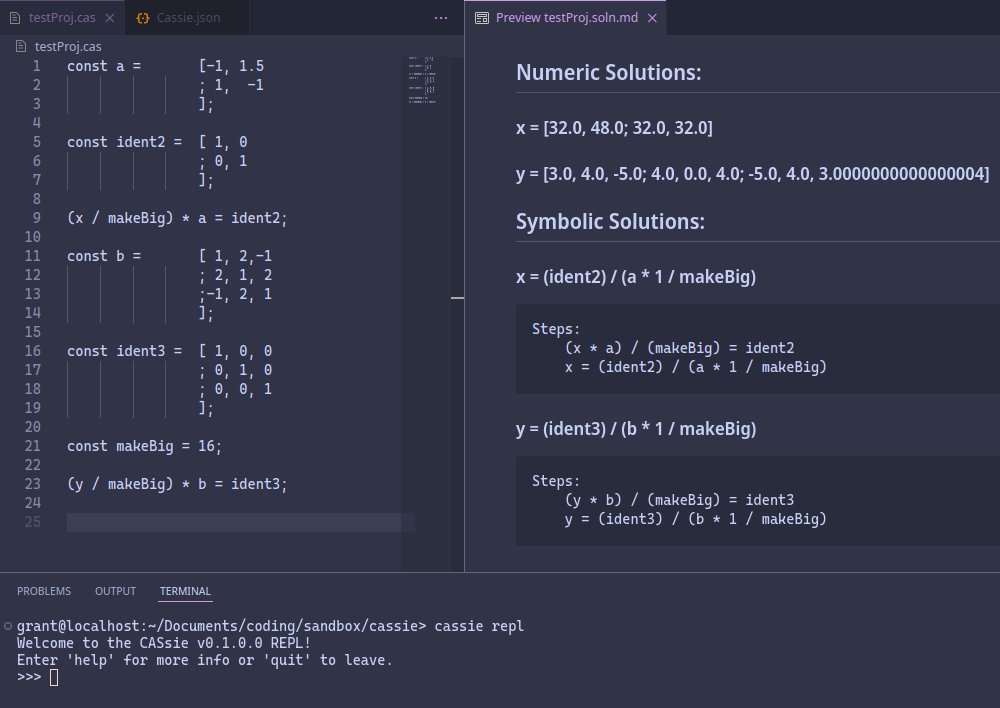

# CASsie
### A simple, homebrewed CAS and equation solver
CASsie is a command-line tool and basic language for solving systems of equations. It can be used to solve systems written into a text file or typed into a REPL. 

CASsie supports mixing matrices and real numbers and can symbolically backsolve for either:

